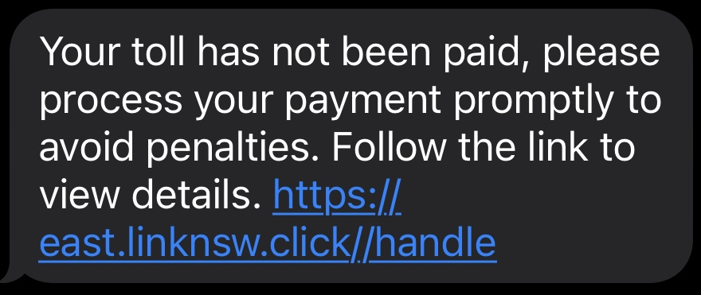
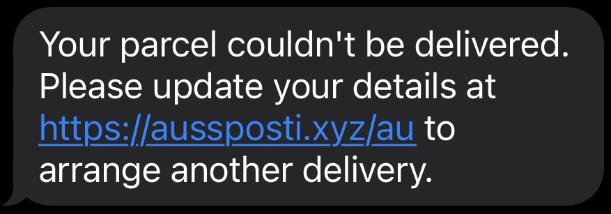
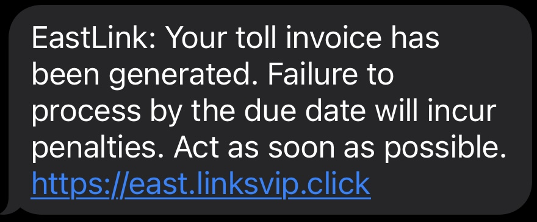
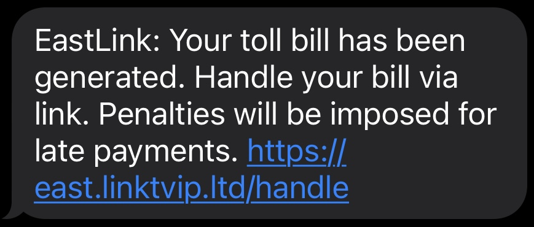
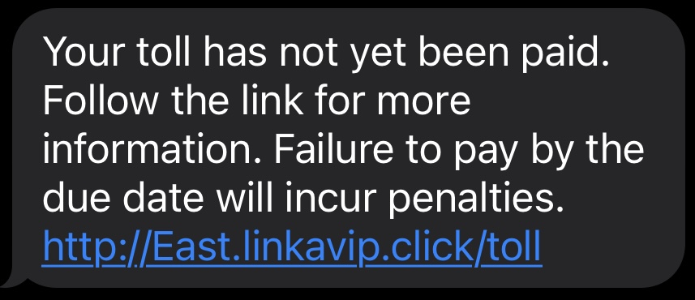
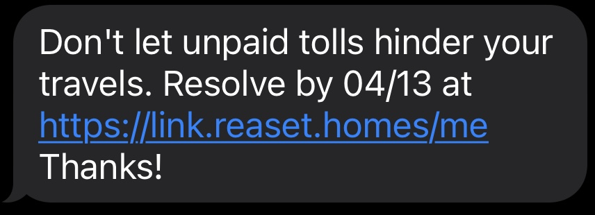

This entry records the existing SMS scam screenshots as a reference set for future analysis and writeups.

## Notes

- Review recurring sender patterns.
- Compare language, URLs, and urgency tactics.
- Add screenshots as evidence when writing a warning post.

  
  
  
  
  
  

